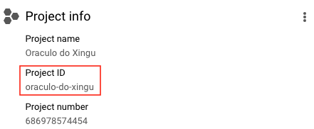

# Como acessar os dados localmente
    
<div class="termy">
    ```console
    $ pip install basedosdados
    ```
</div>

Em apenas 2 passos você consegue obter dados estruturados para baixar e
analisar:

1. Instalar a aplicação
2. Criar um projeto no Google Cloud
2. Realizar sua query para explorar os dados

## Instalando a aplicação

=== "CLI"
    ```bash
    pip install basedosdados
    ```

=== "Python"
    ```bash
    pip install basedosdados
    ```

=== "R"
    Ainda não temos suporte oficial para R, mas recomendamos o pacote [bigrquery](https://bigrquery.r-dbi.org/).
    ```bash
    install.packages("bigrquery")
    ```
    Seja a primeira pessoa a contribuir (veja Issue #82 no GitHub)!
=== "Stata"
    ```bash
    # Ainda não temos suporte :( 
    # Seja a primeira pessoa a contribuir (veja Issue #83 no GitHub)!
    ```

## Criando um projeto no Google Cloud

Para criar um projeto no Google Cloud basta ter um email cadastrado no google e
seguir esses passos:

1. Vá para esse link https://console.cloud.google.com/projectselector2/home/dashboard
2. Aceite o Termo de Serviços
3. Clique em Create Project (Criar Projeto)
4. Escolha um nome bacana para o seu projeto :)
5. Clique em Create (Criar)

Veja que seu projeto tem um nome e um Project ID. Esse Project ID é a informação
que você vai usar nos clientes, é o que você coloca em `<YOUR_PROJECT_ID>`. 
Veja que na imagem abaixo o `<YOUR_PROJECT_ID>` é `oraculo-do-xingu`.



## Fazendo queries

Utilize todo o poder do BigQuery onde quiser. Para obter, filtrar ou
cruzar bases basta escrever a query e carregar em sua linguagem
favorita.

Abaixo você pode seguir um exemplo de **como cruzar as tabelas de população e PIB do
IBGE para obter o PIB per capita de todos os municípios brasileiros
em todos os anos disponíveis**.

=== "CLI"
    ```bash
    basedosdados download "where/to/save/file" \
    --billing_project_id <YOUR_PROJECT_ID> \
    --query '
    SELECT 
        pib.id_municipio, 
        pop.ano,  
        pib.PIB / pop.populacao * 1000 as pib_per_capita 
    FROM `basedosdados.br_ibge_pib.municipios` as pib 
    INNER JOIN `basedosdados.br_ibge_populacao.municipios` as pop 
    ON pib.id_municipio = pop.id_municipio AND pib.ano = pop.ano
    LIMIT 100;'
    ```

    Caso esteja rodando a query pela 1a vez, ela vai somente configurar seu ambiente (siga as instruções que irão aparecer). Rode a query novamente para puxar os dados.

    !!! Info
        Por padrão, o BigQuery escolhido para puxar os dados é
        `basedosdados` - mas você pode utilizar também para qualquer projeto
        seu! Basta explicitar seu `query_project_id`.

=== "Python"
    ```python
    import basedosdados as bd

    pib_per_capita = """SELECT 
        pib.id_municipio ,
        pop.ano, 
        pib.PIB / pop.populacao * 1000 as pib_per_capita
    FROM `basedosdados.br_ibge_pib.municipios` as pib
    INNER JOIN `basedosdados.br_ibge_populacao.municipios` as pop
    ON pib.id_municipio = pop.id_municipio AND pib.ano = pop.ano
    """

    # Você pode fazer o download no seu computador
    bd.download(query=pib_per_capita, 
                savepath="where/to/save/file", 
                billing_project_id=<YOUR_PROJECT_ID>)

    # Ou carregar no pandas
    df = bd.read_sql(pib_per_capita, billing_project_id=<YOUR_PROJECT_ID>)

    # Ou carregar uma tabela no pandas
    df = bd.read_table(
            dataset_id='br_ibge_populacao', 
            table_id='municipios',
            billing_project_id=<YOUR_PROJECT_ID>,
            limit=100
    )
    ```

    Caso esteja rodando a query pela 1a vez, ela vai somente configurar seu ambiente (siga as instruções que irão aparecer). Rode a query novamente para puxar os dados.

    !!! Info
        Por padrão, o BigQuery escolhido para puxar os dados é
        `basedosdados` - mas você pode utilizar também para qualquer projeto
        seu! Basta explicitar seu `query_project_id`.

=== "R"
    ```R
    if (!require("bigrquery")) install.packages("bigrquery")
    library("bigrquery")

    project_id = "basedosdados"
    pib_per_capita = """SELECT 
        pib.id_municipio ,
        pop.ano, 
        pib.PIB / pop.populacao * 1000 as pib_per_capita
    FROM `basedosdados.br_ibge_pib.municipios` as pib
    INNER JOIN `basedosdados.br_ibge_populacao.municipios` as pop
    ON pib.id_municipio = pop.id_municipio AND pib.ano = pop.ano
    """

    d <- bq_table_download(bq_project_query(project_id, pib_per_capita), page_size=500)
    ```

=== "Stata"
    ```bash
    # Ainda não temos suporte :(
    # Seja a primeira pessoa a contribuir (veja Issue #83 no GitHub)!
    ```
